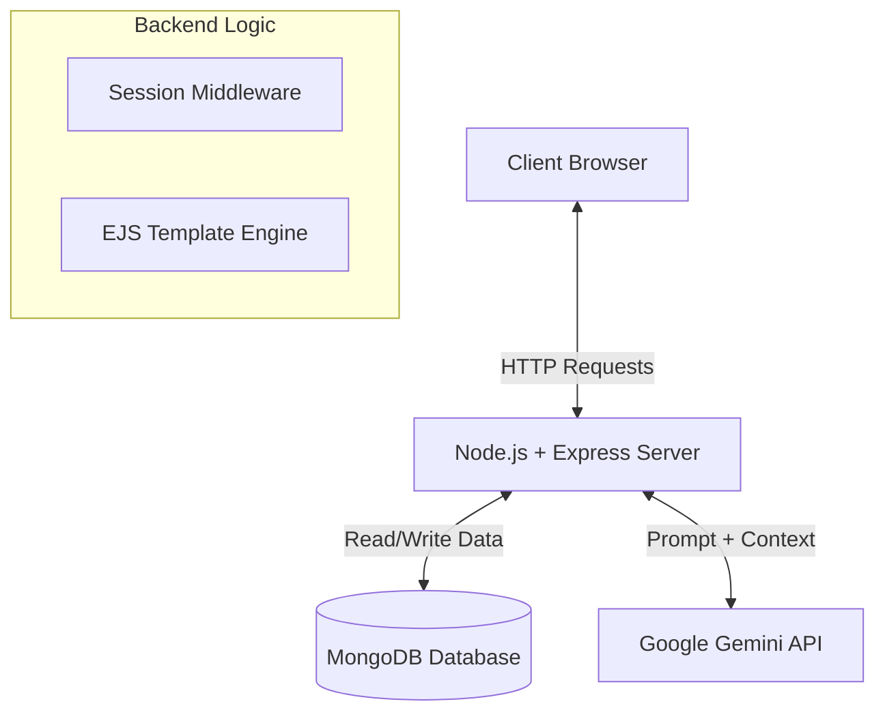

# 🥗 Nutri-Genie: The AI Health Architect

**Hackathon Submission 2025** | Transforming raw bio-data into actionable, hyperpersonalized health strategies.


---

## 📖 Table of Contents

- [The Problem](#-the-problem)
- [The Solution](#-the-solution)
- [System Architecture](#-system-architecture)
- [Key Features](#-key-features)
- [Technical Deep Dive](#️-technical-deep-dive)
- [Installation & Setup](#-installation--setup)
- [Project Structure](#-project-structure)
- [Future Roadmap](#-future-roadmap)
- [Acknowledgements](#-acknowledgements)

---

## 💡 The Problem

In the modern healthcare landscape, information is abundant but personalization is scarce.

1. **Generic Advice**: "Eat less, move more" fails to account for individual metabolic rates (BMR), dietary restrictions (Vegan/Keto), or specific goals.
2. **Analysis Paralysis**: Calculating TDEE, macros, and designing workout splits manually is complex and demotivating for beginners.
3. **Lack of Continuity**: Most users start a diet but fail to track progress or maintain a history of their health data.

---

## 🚀 The Solution

**Nutri-Genie** acts as a **24/7 Personal Health Consultant**. It bridges the gap between medical data and daily habits by leveraging Google's Gemini AI with a robust Node.js/MongoDB backend.

### What it delivers:

- **Instant Bio-Analysis**: Calculates BMR and TDEE instantly based on user stats.
- **Hyper-Personalization**: Generates structured meal plans and workout routines that respect allergies and specific goals.
- **Long-term Tracking**: Persists data to visualize the user's health journey over time using a persistent database.

---

## 🏗 System Architecture

The application follows a **Model-View-Controller (MVC)** inspired architecture:



### Flow:

1. **Input**: User submits bio-data via a responsive Form.
2. **Processing**: Server constructs a context-aware prompt using the user's specific data points.
3. **Intelligence**: Google Gemini 1.5 Flash processes the prompt and returns structured HTML.
4. **Persistence**: The plan is tagged with a Timestamp and User Session, then saved to MongoDB.
5. **Presentation**: EJS renders the data into a Glassmorphism UI using Tailwind CSS.

---

## ✨ Key Features

### 🧠 AI-Powered Intelligence

- **Gemini 1.5 Flash**: Utilizes Google's latest LLM for sub-second latency and high accuracy.
- **Structured Output**: The AI is engineered to return clean HTML for seamless frontend rendering.
- **Context Awareness**: Adjusts recommendations based on activity level (Sedentary vs. Active).

### 🎨 Modern Glassmorphism UI

- **Tailwind CSS**: Built with a utility-first framework for rapid development.
- **Aesthetics**: Features frosted glass cards (`backdrop-filter: blur`), smooth gradients, and floating animations.
- **Responsive**: Fully optimized for Mobile, Tablet, and Desktop screens.

### 🔐 Security & State

- **Session Management**: Uses `express-session` to maintain user login state and protect dashboard routes.
- **Environment Security**: API keys and Database Connection Strings are protected via `.env` configuration.

### 📊 Smart Dashboard

- **History Tracking**: Users can view every plan they've ever generated.
- **CRUD Operations**: Includes functionality to View and Delete old plans.
- **Visual Polish**: Includes SVG illustrations for empty states and loading spinners for better UX.

---

## ⚙️ Technical Deep Dive

### Database Schema (MongoDB)

We store user plans as flexible documents in the `plans` collection. This NoSQL approach allows us to adapt the data structure easily.

**Document Structure:**

```json
{
  "_id": "ObjectId('...')",
  "username": "user_session_id",
  "age": "24",
  "weight": "70",
  "height": "175",
  "goal": "Muscle Gain",
  "aiReport": "<h3>Weekly Plan</h3><ul>...</ul>",
  "createdAt": "2025-11-21T10:00:00.000Z"
}
```

### 🤖 Prompt Engineering

To ensure high-quality outputs, we use a specific **Role Prompting** strategy:

> "Act as a professional expert nutritionist. I am a [AGE] year old [GENDER]... Based on this, generate a strictly structured diet plan. IMPORTANT: Format your response using HTML tags only..."

This ensures the AI adopts the correct persona and strictly adheres to the formatting requirements needed for the frontend.

### 🛠️ Tech Stack

| Component | Technology | Description |
|-----------|-----------|-------------|
| **Frontend** | EJS + HTML5 | Server-side rendering for dynamic views |
| **Styling** | Tailwind CSS | Utility-first framework via CDN |
| **Backend** | Node.js + Express | RESTful API and Route handling |
| **Database** | MongoDB | Native Driver for high-performance storage |
| **AI Model** | Gemini 1.5 Flash | Generative text processing |
| **Version Control** | Git & GitHub | Source code management |

---

## 💻 Installation & Setup

Follow these steps to run the project locally:

### 1. Clone the Repository

```bash
git clone https://github.com/parthgenx/Nutri-Genie.git
cd Nutri-Genie
```

### 2. Install Dependencies

```bash
npm install
```

### 3. Set Up Environment Variables

Create a `.env` file in the root directory and add the following keys:

```env
# Database Connection (Local or Atlas)
MONGODB_URI=mongodb://localhost:27017/NutriGenie

# Google AI Key (Get one at https://aistudio.google.com/)
GEMINI_API_KEY=your_actual_api_key_here

# Session Secret (Random string for security)
SESSION_SECRET=hackathon_super_secret
```

### 4. Run the Server

```bash
# For development (auto-restart)
npx nodemon server.js

# For production
node server.js
```

### 5. Launch

Visit **http://localhost:3000** in your browser.

---

## 📂 Project Structure

```
Nutri-Genie/
├── node_modules/          # Dependencies
├── public/                # Static assets (images, css)
├── views/                 # EJS Templates
│   ├── home.ejs          # Landing Page (Marketing)
│   ├── login.ejs         # Authentication View
│   ├── index.ejs         # Data Input Form
│   ├── result.ejs        # AI Result Display
│   └── dashboard.ejs     # User History & Stats
├── .env                   # Environment variables (Ignored by Git)
├── .gitignore            # Git ignore rules
├── package.json          # Project configuration
├── README.md             # Documentation
└── server.js             # Main application entry point
```

---

## 🔮 Future Roadmap

- 📈 **Data Visualization**: Integrating Chart.js to render real-time weight trend graphs.
- 📄 **PDF Export**: Using puppeteer to generate downloadable PDF reports of diet plans.
- 📱 **PWA Support**: Making the app installable on mobile devices as a Progressive Web App.
- 🔐 **OAuth 2.0**: Implementing "Sign in with Google" for frictionless onboarding.

---

## 🏆 Acknowledgements

- **Google Gemini API** for the intelligence engine.
- Special thanks to all hackathon participants and mentors.

---

## 📝 License

This project is open source and available under the [MIT License](LICENSE).

---

## 🤝 Contributing

Contributions, issues, and feature requests are welcome! Feel free to check the [issues page](https://github.com/parthgenx/Nutri-Genie/issues).

---

## 👨‍💻 Author

**Parth**
- GitHub: [@parthgenx](https://github.com/parthgenx)

---

<div align="center">
  <strong>⭐ Star this repository if you found it helpful!</strong>
</div>
